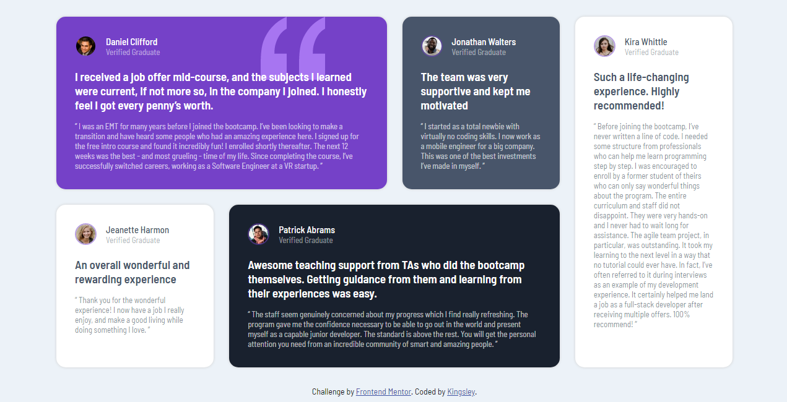

# Frontend Mentor - Testimonials grid section 

### Screenshot

## Overview

### Project Description

This project showcases a responsive grid layout of testimonials using HTML and CSS Grid. The design is implemented with various techniques to ensure an engaging and adaptable user interface across different devices. The layout takes advantage of CSS Grid's powerful features, including spanning, media queries, and pseudo-selectors, to create a flexible and visually appealing testimonial section.

### Key Features

- Responsive Design: Employs media queries to adjust the grid layout for different screen sizes, ensuring optimal viewing on desktops, tablets, and mobile devices.
- Spanning Techniques: Implements grid item spanning to create a dynamic layout where certain testimonials span multiple columns or rows, enhancing the visual hierarchy.

### Built with

- Semantic HTML5 markup
- CSS custom properties
- CSS Grid

## Author
- Kingsley Kamkwamba
- Twitter - [@_kingsl3y](https://x.com/_kingsl3y)

## Acknowledgments
- Frontend Mentor (Design)

- Traversy Media (CSS Grid Tutorial) 
[Traversymedia.com](https://traversymedia.com)
